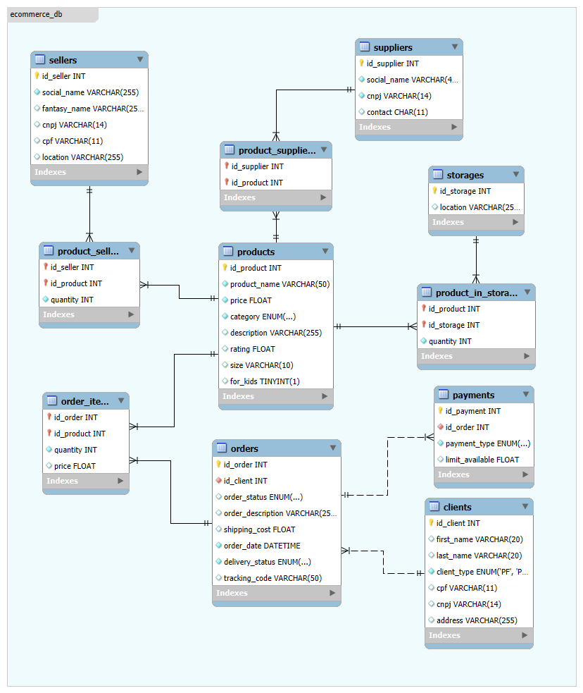

Entendido! Com base na estrutura e na estética do exemplo que você forneceu, preparei uma nova versão do README.md para o seu projeto de E-commerce. Ele é mais detalhado, profissional e bem organizado.

Pode copiar e colar o texto abaixo diretamente no seu arquivo README.md.

Projeto de Banco de Dados para E-commerce 🚀
O E-commerce DB é um projeto que fornece um esquema de banco de dados relacional completo para uma plataforma de comércio eletrônico. Ele coordena todas as entidades e processos essenciais, desde o cadastro de clientes e produtos até a conclusão de um pedido, garantindo a integridade dos dados e a performance das consultas.

O sistema se concentra em entidades centrais para gerenciar o fluxo de vendas:

Clientes (Clients): Entidade que armazena informações de compradores, com suporte para Pessoa Física (PF) e Jurídica (PJ).

Produtos (Products): Catálogo de itens à venda, incluindo detalhes como preço, categoria e estoque.

Pedidos (Orders): Registra as transações realizadas pelos clientes, vinculando produtos, pagamentos e informações de entrega.

Fornecedores e Vendedores (Suppliers & Sellers): Entidades que gerenciam a origem dos produtos, seja por fornecimento direto ou por venda de terceiros (modelo marketplace).

Principais Características
Modelagem Abrangente: Cobre todo o ciclo de vida de uma venda, desde o gerenciamento de estoque e fornecedores até o rastreamento da entrega ao cliente final.

Suporte a Clientes PF e PJ: Permite o cadastro flexível de diferentes tipos de clientes, garantindo que as informações fiscais (CPF ou CNPJ) sejam armazenadas corretamente através de constraints.

Gerenciamento de Relacionamentos: Utiliza tabelas de junção para gerenciar de forma eficiente relações complexas (muitos-para-muitos), como os itens de um pedido e os fornecedores de um produto.

Rastreamento de Pedidos: Acompanha o status do pedido e da entrega, fornecendo informações claras tanto para o cliente quanto para os administradores do sistema.

Estrutura para Análise: O esquema é projetado para facilitar a extração de relatórios e insights de negócio, como volume de vendas por cliente, produtos mais populares e performance de vendedores.

Arquitetura do Banco de Dados
O projeto segue os princípios de modelagem de um banco de dados relacional para garantir consistência, performance e separação de responsabilidades:

Camada de Dados (Model): Contém as entidades de negócio centrais (Clientes, Produtos, Pedidos, etc.) e seus relacionamentos, definidos através de chaves primárias e estrangeiras para garantir a integridade referencial.

Lógica de Integridade (Constraints): Implementa regras de negócio diretamente no banco de dados, como a verificação do tipo de cliente (PF/PJ), a unicidade de documentos e valores padrão.

Visão para Consultas (Views/Queries): A estrutura permite a criação de visões e consultas complexas que unem as tabelas para fornecer uma perspectiva completa dos dados, servindo como base para relatórios e para a camada de aplicação.

O E-commerce DB foi projetado com a escalabilidade em mente, permitindo que seja utilizado tanto por pequenas lojas virtuais quanto por grandes plataformas de marketplace. O projeto prioriza uma modelagem limpa e uma arquitetura de dados sustentável para garantir confiabilidade a longo prazo e facilidade na implementação de novas funcionalidades.
